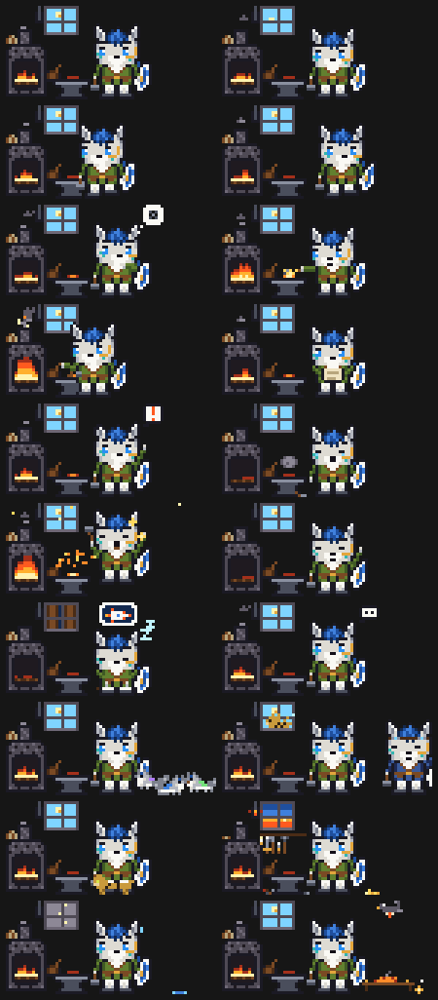
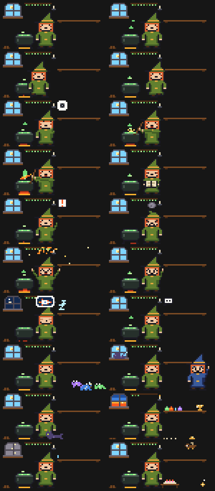

# Diorama

Un petit monde en pixel art qui vit au-dessus du prompt de Claude Code.

Un personnage suit le travail de Claude, sans qu'on ait rien à faire :
- il réfléchit quand le modèle réfléchit et se met à l'ouvrage quand un outil tourne ;
- il éprouve les tests, scelle les commits, attend la personne quand Claude a une question ;
- il fait la sieste après dix minutes de calme.

Chaque sous-agent arrive en petite créature, puis repart sa mission faite. Les sessions ouvertes sur la même machine se rendent visite et s'envoient des nouvelles, et un animal unique passe de l'une à l'autre.

À côté de la scène s'affichent les jauges de contexte, de la fenêtre de 5 h et de celle de 7 jours, avec l'heure de leur remise à zéro. Il y a aussi l'expérience gagnée, ce que fait Claude en ce moment et un journal court.

| La forge (thème par défaut) | L'antre de la sorcière |
|---|---|
|  |  |

## Installation

Il faut Claude Code avec les mods (plugins de *function hooks*), et un terminal à couleurs vraies. Le mod a été testé avec la version 2.1.291, sous Windows Terminal.

```
claude plugin marketplace add scorpheus/Diorama
claude plugin install diorama@diorama
```

Ouvrez ensuite une nouvelle session : le bandeau apparaît au-dessus du prompt. Pour mettre à jour : `claude plugin update diorama@diorama`.

## Réglages (`/config`)

| réglage | valeurs |
|---|---|
| **Thème** | `forge` (par défaut), `sorciere`, ou le chemin absolu d'un `theme.json` à soi |
| **Largeur de la scène** | `auto` prend la plus large qui tient à côté du texte ; `complet`, `compact` et `seul` réduisent la scène |
| **Répliques** | `local` : des phrases toutes prêtes, sans coût ; `haiku` : Haiku écrit la réplique de fin de tour ; `aucune` : le personnage se tait |
| **Statut de la tâche** | `haiku` : Haiku résume la tâche et où elle en est ; `simple` : sans modèle ; `aucun` |

**Ce que coûte Haiku.** Avec les réglages par défaut, Haiku est appelé :
- une fois par conversation, pour choisir la tenue du personnage ;
- une fois par sous-agent, pour lui donner un nom ;
- une fois par conversation, à la première sieste, pour le rêve ;
- pour le statut de la tâche : une fois par demande, au plus une fois toutes les deux minutes de travail, et une fois en fin de tour.

Chaque appel coûte quelques centaines de jetons, sur votre compte. Pour n'en faire aucun : *Statut* `simple` ou `aucun`, et *Répliques* `local` ou `aucune`. Il restera tout de même les appels pour la tenue, le nom des aides et le rêve. Haiku reçoit le début de la conversation, des extraits de réponses et les noms des actions en cours.

## Un thème à soi

Le forgeron n'est qu'un thème. Un personnage différent, avec son décor et ses mots, tient dans **un seul fichier JSON**.

Le plus simple : demandez-le à Claude, avec la compétence fournie par le plugin.

```
/diorama:nouveau-theme un pirate dans la cale de son navire, des perroquets comme aides
```

Claude dessine le thème, vous montre des aperçus et le retouche avec vous, puis l'enregistre. Il reste à mettre son chemin dans `/config` → *Thème*. Le bandeau se redessine ensuite tout seul à chaque modification du fichier.

Le format est décrit dans [THEMES.md](THEMES.md), et l'antre de la sorcière ([themes/sorciere/theme.json](themes/sorciere/theme.json)) sert d'exemple complet. Pour vérifier un thème et en tirer une planche PNG, avec Node 22.6 ou plus :

```
node tools/apercu.mts mon-theme.json apercu.png
```

Pour partager un thème, ouvrez une demande de fusion avec un dossier `themes/<nom>/`.

## Ce que le mod garde, et où

- **L'état de la session** (jauges, équipe, journal) vit en mémoire dans Claude Code.
- **Le stockage local du plugin** est partagé entre les sessions de la machine. Il contient ce qui fait vivre les échanges entre sessions :
  - la présence et la tenue de chaque session ;
  - les visites en cours et les nouvelles envoyées ;
  - l'animal et le banquet du jour ;
  - les trophées de chaque conversation et ses chefs-d'œuvre.
- Rien ne sort de la machine, sauf les appels à Haiku décrits plus haut.

## Développer

```
claude plugin validate .
claude plugin test .
```

Pour tester sans installer, chargez le dossier directement : `CLAUDE_CODE_PLUGIN_DIRS=<chemin du dépôt>` dans l'`env` de `~/.claude/settings.json`. Chaque modification d'un fichier recharge alors le mod dans les sessions ouvertes. Ne l'installez pas en même temps par le marketplace : il serait chargé deux fois.

Le code se répartit ainsi :

| fichier | rôle |
|---|---|
| `hooks/register.tsx` | le moteur : il suit Claude Code et tient le `World` |
| `hooks/world.ts` | le contrat entre le moteur et un thème |
| `hooks/themes/forge.ts` | la forge, dessinée en code |
| `hooks/themes/data.ts` | lit un thème JSON et le vérifie |
| `hooks/props.ts` | ce que tous les thèmes partagent : palette, bulles, ciel, rêves |

## Licence

MIT. Voir [LICENSE](LICENSE).
